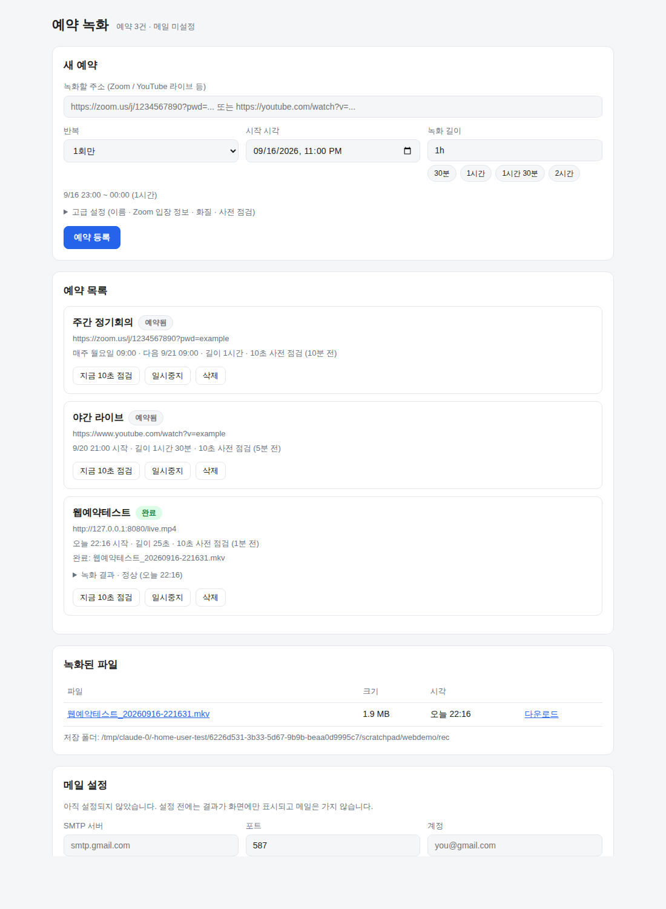

# webrec - 예약 웹 라이브 녹화기

정해진 시간에 **Zoom · YouTube 라이브 등 웹 동영상 주소**에 접속해 녹화하고 파일로 저장합니다.
시간과 주소만 입력하면 되고, **본 녹화 전 10초 샘플링으로 녹화가 실제로 되는지 미리 확인**하며,
문제가 생기거나 정상 종료되면 **메일로 알려줍니다**(기본 수신자: `travislee@shinwon.com`).

```
 예약 시각 5분 전            예약 시각               녹화 종료
      │                        │                        │
      ▼                        ▼                        ▼
 [10초 샘플 녹화] ──▶ [검증] ──▶ [본 녹화 시작] ──▶ [결과물 검증] ──▶ [메일 통보]
      │                  │                                   │
      └─ 실패 시 메일 ◀───┘                     끊기면 자동 재시도 후 이어붙이기
```

## 1. 무엇을 확인하는가 (샘플링 점검)

"파일이 생겼다"와 "제대로 녹화됐다"는 다릅니다. 본 녹화와 **똑같은 방식으로 10초를 미리 녹화**한 뒤
다음을 검사합니다.

| 검사 항목 | 잡아내는 사고 |
|---|---|
| **접속 확인** | 링크 만료·오타·차단·회의 미개설 — 페이지가 안 열리는 경우 |
| 파일 크기 / ffprobe 해석 | 연결 실패로 빈 파일만 생기는 경우 |
| 비디오 스트림·해상도 | 소리만 녹음되는 경우 |
| 실제 녹화 길이 | 즉시 끊겨 1~2초만 담기는 경우 |
| **검은 화면 비율** | 로그인 실패·빈 페이지·대기실 화면만 담기는 경우 |
| 오디오 스트림·평균 음량 | 소리가 하나도 안 들어오는 경우 (`require_audio: true` 면 실패 처리) |

접속 확인이 먼저인 이유가 있습니다. 브라우저 캡처는 **페이지가 안 열려도 브라우저 에러 화면이
그대로 녹화**되는데, 흰 바탕 에러 페이지는 "검은 화면"이 아니라서 화면 검사만으로는 통과해 버립니다.
그래서 샘플을 뜨기 전에 주소를 한 번 찔러보고, 접속 자체가 안 되면 녹화하지 않고 바로 실패로 알립니다.
(Playwright 를 쓰는 경우 페이지 이동 실패도 오류로 보고합니다.)

점검 결과는 메일로 오고, `abort_on_failure: true` 로 두면 **점검 실패 시 본 녹화를 아예 취소**합니다
(기본값은 `false` — 방송 시작 전이라 점검이 실패하는 일이 흔하므로 녹화는 그대로 진행).

## 2. 웹 화면으로 예약하기 (가장 쉬운 방법)

내 PC 에서 서버를 띄우고 브라우저에서 **주소와 시간만 입력**하면 끝입니다.

```bash
python3 -m webrec serve --open
#  → http://127.0.0.1:8765 이 열립니다
```



화면에서 할 수 있는 것

| 구역 | 내용 |
|---|---|
| **새 예약** | 주소 · 시작 시각 · 녹화 길이만 넣으면 등록. 종료 시각이 자동 계산돼 `9/16 23:00 ~ 00:00` 처럼 미리 보입니다 |
| 반복 | 1회 / 매일 / 매주(요일 선택) / cron 직접 입력 |
| 고급 설정 | 이름, 캡처 방식, Zoom 표시이름·이메일·암호, 해상도·프레임, 사전 점검 길이와 시점 |
| **예약 목록** | 상태 배지(예약됨 → 점검중 → 대기중 → 녹화중 → 완료), 녹화 중 진행 막대와 남은 시간 |
| | `지금 10초 점검` 버튼으로 아무 때나 녹화 가능 여부 확인 |
| | 각 예약의 사전 점검·검증 결과를 검사 항목별로 펼쳐보기 |
| **녹화된 파일** | 브라우저에서 바로 재생하거나 다운로드 |
| **메일 설정** | SMTP 정보를 넣고 테스트 발송. 안 넣으면 결과가 화면에만 표시됩니다 |

옵션

```bash
python3 -m webrec serve --port 9000          # 포트 변경
python3 -m webrec serve --out D:/녹화         # 저장 폴더 지정
python3 -m webrec serve --host 0.0.0.0       # 같은 네트워크의 다른 기기에서도 접속
```

기본값은 `127.0.0.1` 이라 **내 PC 에서만** 열립니다. 예약 목록은 `.webrec/jobs.json` 에 저장되므로
프로그램을 껐다 켜도 그대로 남습니다. 다만 **프로그램이 꺼져 있는 동안의 예약 시각은 지나갑니다** —
녹화 시간에는 이 창이 떠 있어야 하고, 늦게 켠 경우 남은 시간만큼만 녹화한 뒤 그 사실을 알려줍니다.

## 3. 설치

```bash
git clone <이 저장소> && cd webrec
bash scripts/install_deps.sh     # ffmpeg, Xvfb, PulseAudio, Chromium, 파이썬 패키지
python3 -m webrec doctor         # 준비 상태 확인
python3 -m webrec serve --open   # 웹 화면 열기
```

웹 화면은 추가 패키지 없이 파이썬 표준 라이브러리만으로 동작합니다(Flask 등 불필요).

수동 설치 시 필요한 것:

| 구성요소 | 용도 | 필수 여부 |
|---|---|---|
| `ffmpeg` / `ffprobe` | 녹화·검증 | **필수** |
| `PyYAML` | 설정 파일 | **필수** |
| `yt-dlp` | YouTube/Twitch 등 스트림 주소 해석 | 권장 |
| `Xvfb`, Chromium | 브라우저 화면 캡처(Zoom 등) | 브라우저 방식에 필요 |
| `PulseAudio` | 브라우저 소리 캡처 | 소리가 필요하면 |
| `playwright` | Zoom 이름/암호 입력 자동화 | 선택 |

## 4. 명령줄로 쓰기

### 지금 이 주소가 녹화 가능한지 10초로 확인
```bash
python3 -m webrec check --url "https://www.youtube.com/watch?v=XXXX"
```

### 시간과 주소만 주고 1회 예약 녹화
```bash
python3 -m webrec once \
  --url "https://zoom.us/j/1234567890?pwd=abcd" \
  --at  "2026-09-20 21:00" \
  --duration 1h30m \
  --passcode "회의암호" \
  --display-name "회의 녹화"
```
지정 시각 5분 전에 10초 샘플 점검 → 21:00 정각에 녹화 시작 → 1시간 30분 후 저장 → 결과 메일.

### 여러 예약을 계속 돌리기 (권장)
```bash
cp config.example.yaml webrec.yaml   # 주소·시간 수정
python3 -m webrec list               # 다음 실행 시각 확인
python3 -m webrec run                # 상시 실행 (systemd 등록은 scripts/webrec.service 참고)
```

## 5. 설정 파일 (여러 예약을 파일로 관리할 때)

```yaml
smtp:
  host: smtp.gmail.com
  port: 587
  username: ${SMTP_USER}
  password: ${SMTP_PASS}        # Gmail 은 '앱 비밀번호'

defaults:
  output_dir: recordings
  timezone: Asia/Seoul
  preflight:
    enabled: true
    duration: 10                # 10초 샘플링
    lead_seconds: 300           # 시작 5분 전 점검
    abort_on_failure: false
  notify:
    to: travislee@shinwon.com
    on: [preflight_failed, started, completed, failed]

jobs:
  - name: youtube-live          # 1회성 예약
    url: https://www.youtube.com/watch?v=XXXX
    start: "2026-09-20 21:00"
    duration: 1h30m

  - name: weekly-zoom           # 매주 월·수 09:00 반복
    url: https://zoom.us/j/1234567890?pwd=XXXX
    cron: "0 9 * * mon,wed"
    duration: 1h
    backend: browser
    browser:
      display_name: "회의 녹화"
      email: ${ZOOM_EMAIL}        # 웨비나는 이메일을 요구하는 경우가 많습니다
      passcode: ${ZOOM_PASSCODE}
```

주요 항목

| 항목 | 설명 |
|---|---|
| `url` | 녹화할 라이브 주소 (필수) |
| `start` / `cron` | 1회 예약 시각 / 반복 예약(분 시 일 월 요일). 둘 중 하나 |
| `duration` | 녹화 길이 — `3600`, `90m`, `1h30m` |
| `backend` | `auto`(기본) / `stream` / `browser` |
| `timezone` | 예: `Asia/Seoul` (생략 시 서버 시간) |
| `max_retries` | 중간에 끊겼을 때 재시도 횟수 (기본 3) |
| `stall_timeout` | 이 시간(초) 동안 파일이 안 커지면 끊긴 것으로 판단 (기본 90) |
| `remux_mp4` | `true` 면 녹화 후 mp4 로 변환 |
| `video.container` | 기본 `mkv` — 프로그램이 비정상 종료돼도 파일이 살아남습니다 |
| `notify.on` | `preflight_passed`, `preflight_failed`, `started`, `completed`, `failed` |

## 6. 두 가지 캡처 방식

| | `stream` | `browser` |
|---|---|---|
| 방법 | yt-dlp 로 실제 미디어 주소를 얻어 ffmpeg 이 그대로 저장 | 가상 화면(Xvfb)에 브라우저를 띄우고 화면+소리를 캡처 |
| 장점 | 원본 화질, CPU 거의 안 씀 | 로그인·클릭이 필요한 어떤 사이트든 가능 |
| 대상 | YouTube, Twitch, 치지직, m3u8 직링크 등 | **Zoom**, 사내 웨비나, 회원 전용 페이지 |

`backend: auto` 면 주소를 보고 자동 선택합니다 (Zoom → browser, YouTube 등 → stream).

**Zoom 은 이렇게 동작합니다**: 초대 링크(회의 `/j/`, 웨비나 `/w/`, 개인 링크 `/my/`)를 웹 클라이언트
주소 `/wc/join/<번호>` 로 바꾸고 — 이때 등록 토큰 `tk` 와 암호 `pwd` 쿼리는 그대로 유지합니다 —
`display_name`·`email`·`passcode` 를 채운 뒤 입장 →
"컴퓨터 오디오로 참가"까지 눌러 소리를 확보한 다음 화면을 녹화합니다.
(이 자동 입력은 playwright 가 설치돼 있을 때 동작하며, 실패해도 녹화 자체는 계속됩니다.)

## 7. 메일 설정

비밀번호는 설정 파일에 직접 쓰지 말고 환경변수로 넣으세요.

```bash
cp .env.example .env && vi .env      # SMTP_HOST / SMTP_USER / SMTP_PASS
source .env
python3 -m webrec test-mail          # 테스트 메일 발송
```

보내는 메일은 4종류입니다.

| 이벤트 | 제목 예시 | 내용 |
|---|---|---|
| `preflight_passed` | `[webrec] 사전 점검 정상 - weekly-zoom` | 샘플 검사 항목별 결과 |
| `preflight_failed` | `[webrec] [주의] 사전 점검 실패 - weekly-zoom` | 실패 원인 + 확인할 사항 |
| `started` | `[webrec] 녹화 시작 - weekly-zoom` | 시작 시각, 저장 위치 |
| `completed` | `[webrec] 녹화 완료 - weekly-zoom` | 파일 경로·크기·길이·해상도, 검증 결과 |
| `failed` | `[webrec] [실패] 녹화 오류 - weekly-zoom` | 실패 단계, 오류, ffmpeg 로그 끝부분 |

SMTP 설정이 없으면 메일 내용을 로그에만 남기고 **녹화는 정상 진행**합니다.

## 8. 끊김 대응

- 스트림이 끊기면 **남은 시간만큼 자동 재시도**하고, 조각 파일을 마지막에 하나로 합칩니다(재인코딩 없음).
- `stall_timeout` 동안 파일 크기가 늘지 않으면 끊긴 것으로 보고 즉시 재접속합니다.
- 기본 컨테이너가 `mkv` 라 정전·강제종료 상황에서도 그때까지의 녹화분이 남습니다.
- 녹화 후 길이·화면·소리를 다시 검증해, 이상하면 `completed` 가 아니라 `failed` 메일이 갑니다.

## 9. 명령어

| 명령 | 설명 |
|---|---|
| `webrec serve [--open]` | **브라우저에서 예약하는 웹 화면** (가장 쉬움) |
| `webrec run [-c 설정]` | 설정 파일의 예약을 계속 지켜보며 실행 |
| `webrec once --url ... --at ... --duration ...` | 1회 예약 녹화 |
| `webrec check --url ...` | 10초 샘플로 녹화 가능 여부만 점검 |
| `webrec verify 파일` | 이미 녹화된 파일 검증 |
| `webrec list [-c 설정]` | 예약 목록과 다음 실행 시각 |
| `webrec doctor` | 필요한 프로그램·메일 설정 점검 |
| `webrec test-mail` | 메일 설정 테스트 |

## 10. 테스트

```bash
python3 -m pytest tests/ -q
```
설정·예약 계산·메일 같은 단위 테스트뿐 아니라, **로컬 HTTP 서버와 실제 ffmpeg 로
"10초 샘플링 → 녹화 → 검증 → 메일"** 전 과정을 돌리는 통합 테스트, 가상 화면에서
브라우저를 띄워 실제로 화면이 담기는지 확인하는 테스트가 포함돼 있습니다.

## 11. 알아두실 점

- 녹화 대상의 **약관과 법령을 먼저 확인하세요.** 회의 녹화는 참석자 고지·동의가 필요한 경우가 많고,
  유료·저작권 콘텐츠의 무단 녹화는 서비스 약관 위반일 수 있습니다.
- DRM 이 걸린 콘텐츠(넷플릭스 등)는 화면 캡처 방식으로도 정상 녹화되지 않습니다.
- 긴 녹화는 디스크 용량을 확인하세요. 720p 기준 대략 **1시간에 1GB 내외**입니다.
